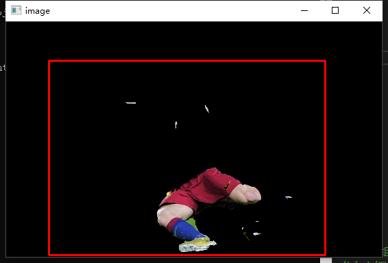

# GrabCut——交互式前景图像分割算法

这个项目是用C++对GrabCut算法的一个简单实现，大部分代码来自[GrabCut-BorderMatting](https://github.com/fbsage/GrabCut-BorderMatting)。对于[messi5.jpg](./OpencV/messi5.jpg)，在Release模式下运行程序，每次迭代可以控制在0.2秒以内。运行结果如下：

相比于原来的工程，我增添了一个**使用彩色直方图代替GMM**来对权重进行估计的选项，只需将[GrabCut.cpp](./OpencV/src/GrabCut.cpp)的`USE_GMM`改为`false`即可。

#### 以下为在[messi5.jpg](./OpencV/messi5.jpg)上的运行结果对比：

输入图像：

使用GMM时，只需要对部分关键点进行标注，就可以快速收敛：

使用彩色直方图时，需要对肢体部分进行大量标注的同时也只分割出了腿部，还需要进一步标注+迭代：

#### 为什么会这样呢？可能的原因：

1、相比于它的祖先GraphCut，GrabCut需要能够处理彩色。而彩色直方图的样本分布非常稀疏，难以根据频率估计概率。

2、颜色直方图只包含了表面的像素强度信息，而GMM则对像素强度数据进行了浓缩处理，剔除了许多冗余信息。

（以上是从我的笔记中整理到的，过了半年我已经回想不出太多东西了）

#### 后记

介绍这个算法的[PPT]("./document/“GrabCut”—%20Interactive%20Foreground%20Extraction%20using%20Iterated%20Graph%20Cuts.pdf")和[学习笔记](./document/note.pdf)（可能有点乱）已经附于[document](./document/)文件夹中，希望对后来的你有帮助。

## 祝你取得理想的offer。
